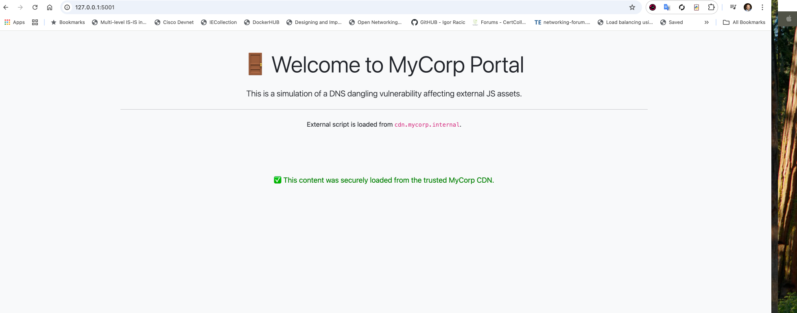
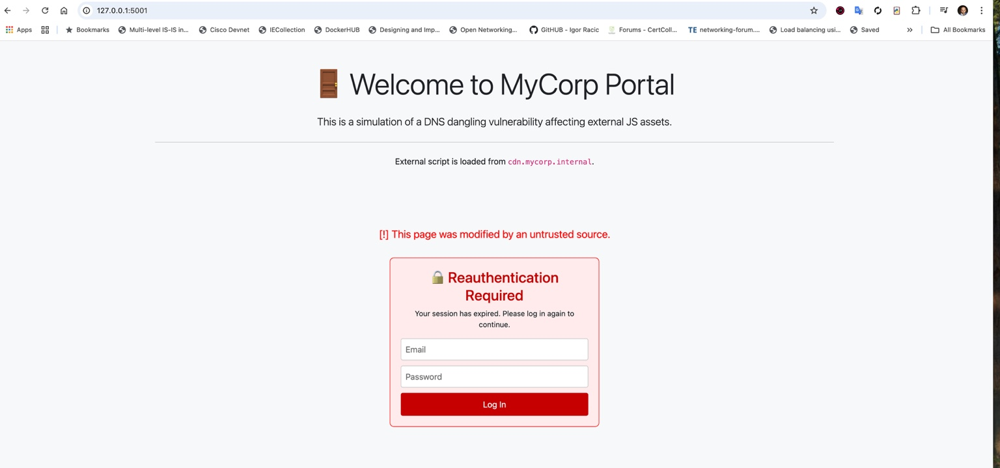

# 🧪 DNS Dangling Demo with Phishing Injection

This lab simulates a DNS dangling vulnerability where a trusted CDN CNAME (`cdn.mycorp.internal`) is hijacked by an attacker. The frontend is a Flask-based portal that loads an external JS file. Depending on DNS resolution, the file may come from a trusted source or an attacker.

---

## 🧩 Components

| Service         | Role                                            |
|------------------|--------------------------------------------------|
| `victim_app`     | UI portal loading JS from `cdn.mycorp.internal` |
| `goodcdn`        | Trusted JS source (green secure message)         |
| `badcdn`         | Attacker JS with phishing login form             |

---

## 📸 Visual Demo

### ✅ Legitimate Response (Good Server)


- Loaded from the trusted MyCorp CDN
- Green secure message
- No tampering

---

### 🚨 Hijacked Response (Bad Server)


- CNAME now points to attacker
- Fake login form injected
- Credential prompt simulates phishing attack

---

## 🧪 How It Works

1. `victim_app` loads:
   ```html
   <script src="http://cdn.mycorp.internal/marketing.js"></script>
   ```
2. The domain `cdn.mycorp.internal` is a CNAME:
   - Initially resolves to `goodcdn`
   - Later hijacked → `badcdn`

---

## 🚀 Running Locally (macOS or Linux)

### 1. Clone & Setup

```bash
git clone https://github.com/YOUR_USERNAME/dns-dangling-demo.git
cd dns-dangling-demo
```

### 2. Add This to `/etc/hosts` on your Mac

```bash
127.0.0.1 cdn.mycorp.internal
```

### 3. Start Good Mode (Safe JS)

Edit `docker-compose.yml`:

```yaml
  goodcdn:
    ports:
      - "80:80"
  badcdn:
    ports:
      - "8081:80"
  victim:
    extra_hosts:
      - "cdn.mycorp.internal:192.168.65.2"
    depends_on:
      - goodcdn
```

Then run:

```bash
docker-compose down
docker-compose up --build victim goodcdn
```

Visit: [http://localhost:5001](http://localhost:5001) ✅

---

### 4. Start Bad Mode (Hijacked JS)

Edit `docker-compose.yml`:

```yaml
  goodcdn:
    ports:
      - "8082:80"
  badcdn:
    ports:
      - "80:80"
  victim:
    extra_hosts:
      - "cdn.mycorp.internal:192.168.65.2"
    depends_on:
      - badcdn
```

Then run:

```bash
docker-compose down
docker-compose up --build victim badcdn
```

Refresh: [http://localhost:5001](http://localhost:5001) 🚨

---

## ☁️ Optional: Cloud Variant

Simulate real DNS with Route 53 + EC2:

- Use Terraform to provision two EC2 instances (good and bad)
- Update Route 53 CNAME target
- Observe behavior from the same frontend

Contact the author or see terraform version for details.

---

## 💡 Why This Matters

DNS misconfigurations or forgotten CNAME targets can be hijacked by attackers. This simulates the **real-world impact of DNS dangling**, including:

- Unauthorized script injection
- Credential phishing
- Loss of trust in hosted applications

---

## 📂 Project Structure

```
victim_app/         → Flask portal (frontend)
good_server/        → Legit JS server
attacker_server/    → Malicious JS with phishing
docker-compose.yml  → Environment definition
README.md           → You're reading it
```
